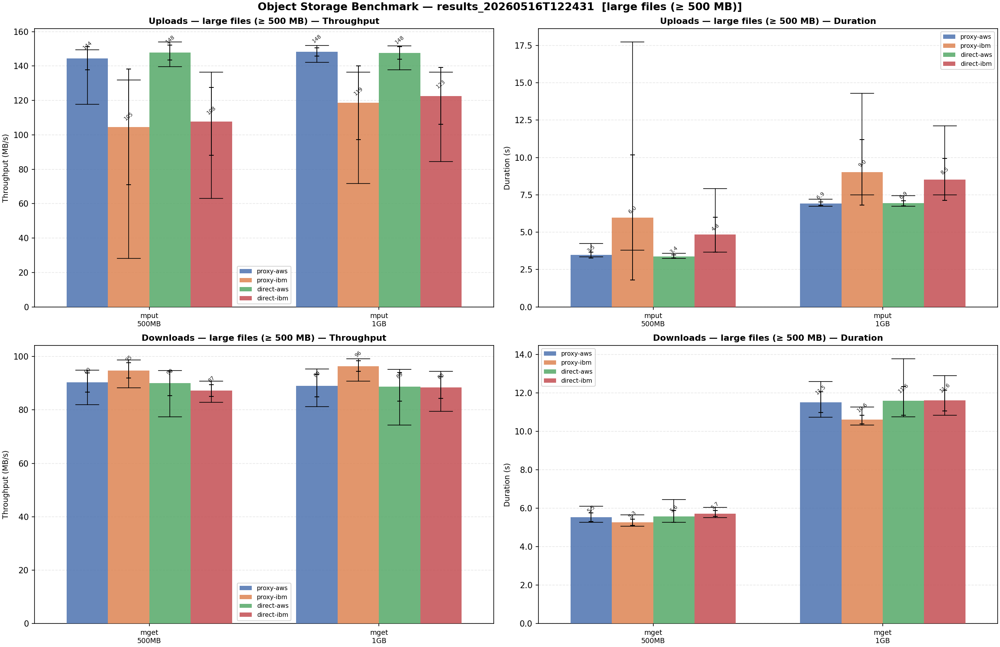
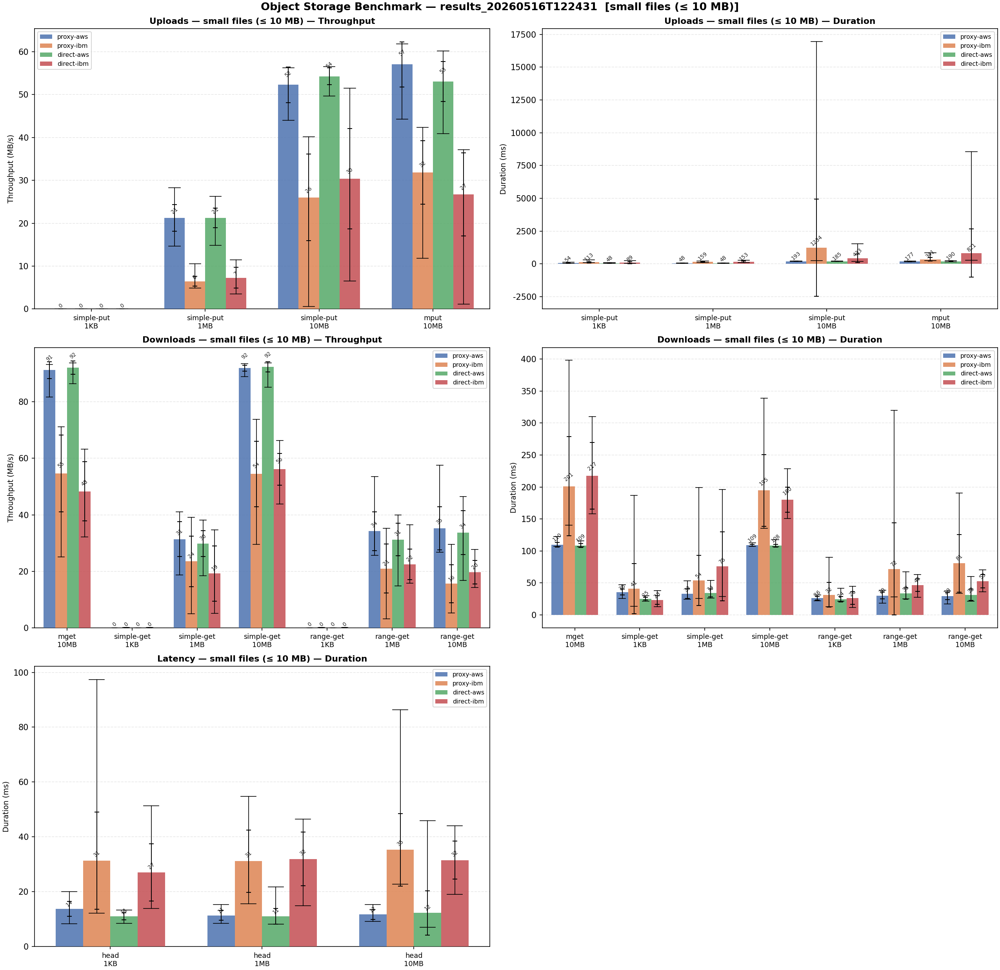

# Object Storage Proxy — Benchmark Results

Benchmarks measure the end-to-end throughput and latency of the proxy against
two storage backends (AWS S3 and IBM Cloud Object Storage), compared against
direct connections to each backend without the proxy.

## Setup

| Backend | Path | Bucket |
|---|---|---|
| **proxy-aws** | client → proxy → AWS S3 eu-west-3 | `proxy-aws-bucket01` |
| **proxy-ibm** | client → proxy → IBM COS eu-de | `proxy-bucket01` |
| **direct-aws** | client → AWS S3 eu-west-3 (no proxy) | `proxy-aws-bucket01` |
| **direct-ibm** | client → IBM COS eu-de (no proxy) | `proxy-bucket01` |

**Test client:** AWS ECS task running in the same AWS region (`eu-west-3`) as the S3 test bucket.  
**Benchmark tool:** [`throughput-rs`](throughput-rs/) — async Rust, `aws-sdk-s3` v1,
parallel multipart with semaphore-based concurrency (10 concurrent parts, 8 MiB part size).  
**Iterations:** 20 runs per operation/size combination. Reported values are the
mean across all iterations; error bars show ±1 standard deviation; whisker lines
show the absolute min and max.

### Operations

| Operation | Description |
|---|---|
| `simple-put` | Single-part PUT — used for objects ≤ 10 MB |
| `mput` | Multipart upload — used for objects ≥ 10 MB |
| `simple-get` / `mget` | Full streaming GET (single-part / chunked) |
| `range-get` | GET with `Range: bytes=0-N` header (first 1 MiB) |
| `head` | HEAD request — metadata round-trip latency only |
| `list` | LIST objects (up to 1 000 keys) |

---

## Results summary

### Large objects (500 MB, 1 GB)

#### Uploads

| Backend | 500 MB mean | 500 MB std | 1 GB mean | 1 GB std |
|---|---|---|---|---|
| proxy-aws | 144.5 MB/s | ±6.7 | 148.3 MB/s | ±2.4 |
| **proxy-ibm** | **104.6 MB/s** | **±33.6** | **118.6 MB/s** | **±21.5** |
| direct-aws | 147.9 MB/s | ±4.4 | 147.6 MB/s | ±3.6 |
| direct-ibm | 107.8 MB/s | ±19.7 | 122.7 MB/s | ±16.5 |

**proxy-aws adds no measurable overhead** over direct-aws — both sustain
~145–148 MB/s with a standard deviation under 7 MB/s, meaning individual
runs are consistently within a few percent of each other.

**IBM-backend uploads are slower and volatile** regardless of whether the
proxy is involved. `direct-ibm` also underperforms at 500 MB (mean 108 MB/s,
std ±20), which confirms the bottleneck is in the IBM COS endpoint or its
connection characteristics, not in the proxy itself. The proxy path
(`proxy-ibm`) is slightly more variable still, with occasional runs dropping
to ~28 MB/s, likely due to interaction between the proxy's connection pool
and IBM COS's tendency to send `Connection: close` on long-lived TLS sessions
mid-upload.

#### Downloads

All four backends deliver **~88–96 MB/s** on large downloads, well within
±5 MB/s of each other. This is consistent with a shared upstream bandwidth
ceiling from the test client's perspective. The proxy adds no measurable
latency or throughput degradation on the download path.

---

### Small objects (1 KB – 10 MB)

#### Uploads

Single-part PUT throughput scales with object size:

| Operation | proxy-aws | proxy-ibm | direct-aws | direct-ibm |
|---|---|---|---|---|
| simple-put 1 MB | 21.3 MB/s | 6.4 MB/s | 21.3 MB/s | 7.3 MB/s |
| simple-put 10 MB | 52.3 MB/s | 26.0 MB/s | 54.3 MB/s | 30.4 MB/s |
| mput 10 MB | 57.5 MB/s | 31.6 MB/s | 53.5 MB/s | 27.4 MB/s |

At 1 MB, IBM backends deliver roughly **one-third** the throughput of AWS
backends (single-part PUT). This reflects a higher per-request setup cost on
IBM COS (TLS session + auth overhead amortised over a smaller payload).
`proxy-ibm` shows particularly high variance at 10 MB (std ±10 MB/s, max
observed 40 MB/s, min 0.6 MB/s) — occasional near-zero runs indicate
connection stalls in this size range.

#### Downloads

`proxy-aws` and `direct-aws` are indistinguishable (both ~90–92 MB/s at 10
MB). IBM backends are slower at this size — `proxy-ibm` averages 54.5 MB/s
on `simple-get 10MB` with high variance (std ±11.6), whereas `direct-ibm`
is more consistent at 56 MB/s (std ±5.6). For objects at 1 MB and below,
throughput numbers reflect latency rather than bandwidth; see the latency
section.

---

### Latency (HEAD, LIST)

> These operations transfer no meaningful payload; the metric is round-trip
> duration in milliseconds.

| Operation | proxy-aws | proxy-ibm | direct-aws | direct-ibm |
|---|---|---|---|---|
| HEAD (1 KB) | 13.7 ms | 31.4 ms | 11.1 ms | 27.1 ms |
| HEAD (1 MB) | 11.4 ms | 31.2 ms | 11.0 ms | 32.0 ms |
| LIST | 33.9 ms | 49.5 ms | 16.4 ms | 24.1 ms |

**proxy-aws** adds ~2–3 ms to a HEAD request compared to direct-aws
(13.7 ms vs 11.1 ms) — one extra network hop on the LAN. This is the
irreducible cost of going through any proxy on the same local network.

**IBM backends** carry an inherent ~16–20 ms penalty over AWS backends
regardless of the proxy, reflecting the extra geographic distance to the
IBM COS eu-de region from the test site and IBM's per-request TLS handshake
behaviour. `proxy-ibm` HEAD latency is additionally volatile (std ±17.7 ms,
max 97 ms) compared to `direct-ibm` (std ±10.4 ms).

**LIST latency** reveals a clearer proxy overhead: `proxy-aws` at 33.9 ms
vs `direct-aws` at 16.4 ms (+17.5 ms). This is higher than the HEAD delta
because LIST responses involve more parsing and re-serialisation inside the
proxy. `direct-ibm` (24.1 ms) is notably faster at LIST than `direct-aws`
(16.4 ms) from this test location; the proxy erases that advantage.

---

## Conclusions

1. **The proxy is transparent for AWS on throughput.** `proxy-aws` matches
   `direct-aws` within measurement noise for all sizes and operations. The
   only real cost is a constant ~2–3 ms round-trip latency penalty from the
   extra LAN hop.

2. **Large-file download performance is backend-limited, not proxy-limited.**
   All four paths saturate at ~90 MB/s, which is the upload bandwidth of the
   test client to the internet.

3. **IBM COS upload performance is inherently lower and less stable than
   AWS S3**, even on the direct path. The proxy amplifies this slightly,
   particularly for large objects where IBM COS's connection-close behaviour
   interacts with the proxy's persistent connection pool.

4. **Small-object IBM performance is the weakest point.** At 1 MB,
   `proxy-ibm` and `direct-ibm` upload at ~6–7 MB/s vs ~21 MB/s for
   AWS — a factor of 3×. This is a property of IBM COS request overhead,
   not of the proxy.

5. **The proxy's LIST overhead (~17 ms over direct) is the largest relative
   latency cost.** Applications that issue frequent LIST requests to IBM COS
   through the proxy will see the biggest relative impact.
